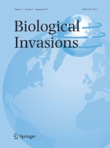

&nbsp;

---
> Data science is the sexiest job of the 21st century

<a href="https://twitter.com/ismasoto"> 
 
 

  

[][mail]

[mail]: mailto:isma-sa@hotmail.com

## **Background:**

I am a PhD candidate at the University of South Bohemia's Faculty of Fisheries and Water Protection, based in Ceske Budejovice (USB). My research primarily revolves around investigating the trends and impacts of invasive species. An integral part of my work involves leveraging the principles of data science, with a particular emphasis on data cleaning and various modeling approaches. I specialize in employing Generalized Linear Models (GLMs), Generalized Additive Models (GAMs), and meta-analytical methods to interpret complex data sets and generate insightful conclusions. This integrative and analytical approach allows for a comprehensive understanding of the patterns and effects of invasive species.

### Ph.D. thesis: Long-term trends and impacts of invasive species in Europe

Supervisors: [Phillip J. Haubrock](https://philliphaubrock.wixsite.com/invasivespecies) & [Antonín Kouba](https://www.jcu.cz/cz/univerzita/lide/clovek?identita=KOUBA_Antonin_32859) 

# **Papers 2024:**

| **ID** | **Title** | **Reference** | **Journal** | **Citations** | **DOI - Link** | **Repository** |
|--------|-----------|---------------|-------------|---------------|----------------|----------------|
| 1 | Economic impact disharmony in global biological invasions | Cuthbert et al. |  |  |  | NA |
| 2 | The wild cost of invasive feral animals worldwide | Soto et al. |  |  |  |  |
| 3 | Assessing the potential phytosanitary threat of the house cricket *Acheta domesticus* | Kulessa et al. |  |  |  |  |
| 4 | Understanding the complex dynamics of zebra mussel invasions over several decades in European rivers: drivers, impacts and predictions | Haubrock et al. |  |  |  |  |
| 5 | Tracking long-term shifts in non-native freshwater macroinvertebrates across three European countries | Toutain et al. |  |  |  | NA |
| 6 | Are long-term biomonitoring efforts overlooking crayfish in European rivers? | Haubrock et al. |  |  |  |   |
| 7 | Exploring invasiveness and versatility of used microhabitats of the globally invasive *Gambusia holbrooki* | Kurtul et al. | |  |  |   |
| 8 | Taming the terminological tempest in invasion science | Soto et al. | |  |  |   | 
| 9 | Discrepancies between non-native and invasive species classifications | Haubrock et al. | |  |  |  NA | 
| 10 | Economic costs of non-native species in Türkiye: A first national synthesis | Serhan et al. | |  |  |    |
| 11 | Determining environmental drivers of global mud snail invasions using climate and hydroclimate models | Aksu et al. | |  |  | NA  |
| 12 | Substantial unrealised global biodiversity of continental microcrustaceans | Macêdo et al. | | NA |  | NA  |
| 13 | Sustained ecological impacts of invasive crayfish following claw injury | Soto et al. |  |  |  | NA  |
| 14 | Decadal-scale regional variability in monitoring efforts significantly influences fish diversity trends in the Euphrates and Tigris catchments, Türkiye | Bayçelebi et al. |  |  |  |  |
| 15 | Potential distribution, observed impacts, and invasion risk of two non-native snapping turtles, *Chelydra serpentina* and *Macrochelys temminckii* | Nerozzi et al. | |  |  |   |
-------------------------------------------------------------------------------------------------------------
## Summary of my research:
 

**Highlight:**

- [SpainIAS - package under develop](https://github.com/IsmaSA/SpainIAS/tree/master)  

# **Main proyects😄**

## Time series database (Haase et al. 2023)

- [Dikerogammarus villosus](https://github.com/IsmaSA/Dikerogammarus-villosus-population-dynamics) => [Soto et al. 2023](https://onlinelibrary.wiley.com/doi/full/10.1111/ddi.13649)
- [Crayfish trends](https://github.com/IsmaSA/Crayfish-trends)  => [Soto et al. 2023](https://www.sciencedirect.com/science/article/abs/pii/S0048969723001523)
- [Ponto-Caspian](https://github.com/IsmaSA/Ponto-Caspian)  => [Soto et al. 2023](https://link.springer.com/article/10.1007/s10530-023-03060-0)
- [Sigmoidal Curves](https://github.com/IsmaSA/Sigmoidal-curves)  => [Soto et al. 2023](https://www.sciencedirect.com/science/article/abs/pii/S0048969723004333)
- [Zebra mussel trends](https://github.com/IsmaSA/Dreissena-polymorpha)

 

## InvaCost [Diagne et al. 2020](https://www.nature.com/articles/s41597-020-00586-z): 
- [Herpetofauna](https://github.com/IsmaSA/Herpetofauna-)  => [Soto et al. 2022](https://www.nature.com/articles/s41598-022-15079-9)
- [Gastropods](https://github.com/IsmaSA/Gastropods)  => [Jiang et al. 2022](https://www.sciencedirect.com/science/article/pii/S1470160X22010871)
- [Canals](https://github.com/IsmaSA/Canal-topic)  => [Balzani et al. 2022](https://oceanrep.geomar.de/id/eprint/57481/)
- [Marine species](https://github.com/IsmaSA/Marine-InvaCost-species) => [Cuthbert et al. 2023](http://digital.ecomagazine.com/publication/?i=767474&p=44&view=issueViewer)
- [Domestic species](https://github.com/IsmaSA/Domestic-InvaCost-topic) => Soto et al.
- [Aquaculture](https://github.com/IsmaSA/Aquaculture) => Oficialdegui et al. 

## Species Distribution Models (SDMs)
- [SDM Course Evora 2022](https://github.com/IsmaSA/SDM_course/tree/master) 
- [Biomod example](https://github.com/IsmaSA/Biomod-package-example) 

## Functional responses (FR)
- [Claws experiment during summer school 2022](https://github.com/IsmaSA/Functional_responses) 

## Others related proyects:
- [Salmonids trends in Cantabria](https://github.com/IsmaSA/Salmonids-trends-Cantabria) => [Soto et al. 2023](https://onlinelibrary.wiley.com/doi/full/10.1002/iroh.202302146)
- [Euphrates & Tigris](https://github.com/IsmaSA/Euphrates-Tigris)
- [Amphipods_Kiel](https://github.com/IsmaSA/Amphipods_Kiel) 
- Melina_snowcrab

## Students
### Gwedaline Le Hen
- Rhine river => [Le Hen et al. 2023](https://www.sciencedirect.com/science/article/abs/pii/S0048969723001018) 

### Mathieu Toutain
- Tracking long-term shifts in non-native freshwater macroinvertebrates => [Toutain et al. 2023](https://www.sciencedirect.com/science/article/abs/pii/S0048969723060291) 

## Just codes
- [European rivers](https://github.com/IsmaSA/European-Rivers-from-milos_agathon) 
- [Extraction of climatic data, Temperature and Precipitation](https://github.com/IsmaSA/extraction-climatic-data)
- [Extract Slopes](https://github.com/IsmaSA/Calculate-S_slope) from (Pilotto et al. 2022)
- [Heat maps](https://github.com/IsmaSA/Orthoptera-heat-maps)
- [Loop to fill time series gaps (Species and abundance)](https://github.com/IsmaSA/Fill-time-series-gaps)

